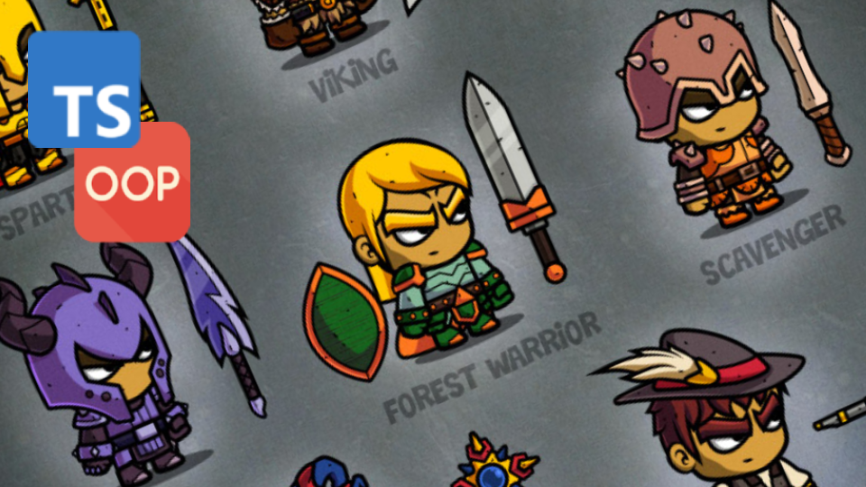
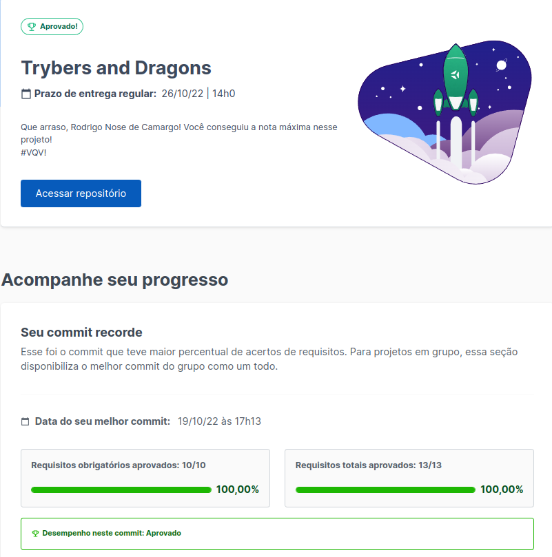

# :dragon_face: Trybers and Dragons :game_die:

## :pencil2: About/Sobre

  
<strong>:us: English</strong>
 

TypeScript, OOP (Object Oriented Programming) and SOLID project developed by [Rodrigo Camargo](https://www.linkedin.com/in/rodrigocamargobr/) at the end of Section 9 ([Back-end Development Module](https://github.com/rodcamargo/trybe-exercicios)) from the Trybe Web Development course. Approved with 100% of requirements met.

In order to use the principles of OOP and SOLID, we created classes, interfaces and types for a _Dungeons and Dragons_ style RPG game.
 

  
<strong>:brazil: Português</strong>
 

Projeto de TypeScript, POO (Programação Orientada a Objetos) e SOLID desenvolvido por [Rodrigo Camargo](https://www.linkedin.com/in/rodrigocamargobr/) ao final da Seção 9 ([Módulo Desenvolvimento Back-end](https://github.com/rodcamargo/trybe-exercicios)) do curso de Desenvolvimento Web da Trybe. Aprovado com 100% dos requisitos atingidos.

Com o objetivo de utilizar os príncípios de POO e SOLID, criamos classes, interfaces e tipos para um jogo de RPG estilo _Dungeons and Dragons_ .
 

## :man_technologist: Developed Skills/Habilidades Desenvolvidas

  
<strong>:us: English</strong>
 

* Create classes and methods
* Define types and interfaces
* Use OOP concepts such as Abstraction, Encapsulation, Inheritance, Composition and Polymorfism
* Use SOLID principles, such as Single Responsability, Open/Closed, Dependency Inversion, Substitution (Liskov) and Interface Segregation
 

  
<strong>:brazil: Português</strong>
 

* Criar classes e métodos
* Definir types e interfaces
* Utilizar conceitos de POO como: Abstração, Encapsulamento, Herança, Composição e Polimorfismo
* Utilizar princípios de SOLID como: Responsabilidade Única, Aberto/Fechado, Inversão de dependência, Substituição de Liskov e Segragação de Interfaces
 

## :hammer_and_wrench: Tools/Ferramentas

* TypeScript
* OOP (Object-Oriented Programming)
* SOLID

## :trophy: Grade/Nota

© Desenvolvido por [Rodrigo Camargo](https://www.linkedin.com/in/rodrigocamargobr/)) 
